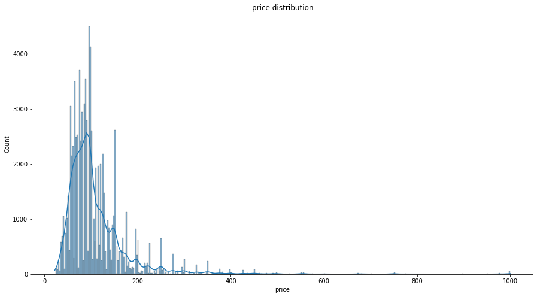
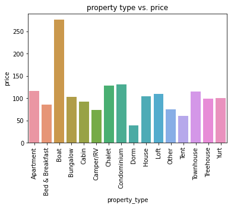

# Airbnb Data Analysis

Data available at (https://www.kaggle.com/airbnb/seattle/data)

Airbnb is a great company that operates an online market place for lodging primarily homestays for vacation rentals, and tourism activities.  
In our investigation we focus on rentals in seatle.

# Questions to investigate 
## 1. which neighbourhood has the most visits? 
## 2. What is the most expenive time to  rent in seatle?
## 3. What is the property type with the greatest cost?

## First question:
we wander what neighbour hood has the most visits 

### It turns out that the most visited neighbourhoods are **Capitol hill** ,**Downtown** and **other neighbour hoods** that are grouped to have more clear plot has the greatest number of visits.
## Price investigation

 We then invistigate the price in these neighbourhoods to check if the pricee is one of the factors that affect the visits.

> ## shows up at the end of analysis that the mostly visited neighbourhoods (DownTown, Capitol Hill and the other remaining neighbourhoods) has almost same price average per years compared to neighbourhoods that have less visits.

> ## but also shows up that price is not the main factor in number of visits per neighbourhood

## Second question:

### It appears that from june to august is th most expensive time to visit or rent in Seatle

## Third Question 

### turns out that boats are the most expensive property to rent

## Machine model

1. using linear regression gives r2 score of 0.59 and 0.54 for train and test set respectively 
2. Random forest gives r2 score of 0.71 and 0.66 train and test set respectively 
3. So we can say that random forest is more representative model for our data and we can conclude that propertytype and the property qualities one of the factors that affect the price. 